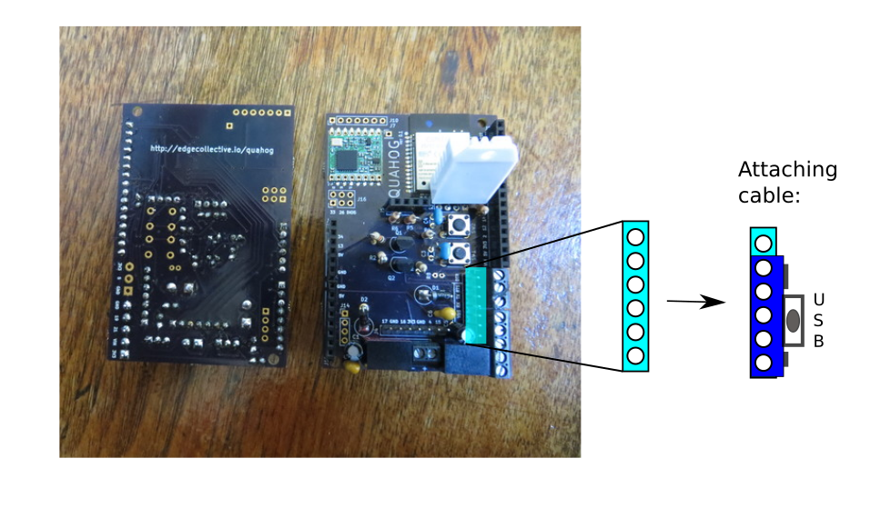

# Quick Quahog Qualification

The below documentation assumes a (recent?) verison of Ubuntu.

## Attaching the programming cable

Attach the CP2104 programming cable to the Quahog on the programming pins.  There are 7 pins on the Quahog; you want the (6-pin) CP2104 to connect to the 'lower' 6 pins on the Quahog's 7-pin port, with the 'top' of the CP2014 facing 'outward/right'.  See diagram:




## Transferring Files to/from Quahog

### Setting up ampy (file transfer utility)

Install virtualenv

``` 
apt-get install virtualenv
```

Create a virtualenv

``` 
virtualenv venv
``` 

Activate it

``` 
source venv/bin/activate
``` 

Install ampy in virtualenv

``` 
pip install adafruit-ampy
``` 

Check which USB port you've got your Quahog on (in most cases, this will be /dev/ttyUSB0).

``` 
ls /dev/ttyUSB*
``` 

### Using ampy to transfer files

(Note: in the following, you may need to use 'sudo'; I believe that the latest versions of Ubuntu require this.)

- Listing files on the Quahog

``` 
ampy -p /dev/ttyUSB0 ls
``` 

- Putting a file on the Quahog

``` 
ampy -p /dev/ttyUSB) put ./foo.py
``` 

- Getting a file from the Quahog

``` 
ampy -p /dev/ttyUSB0 get foo.py
``` 

- Getting a file from the Quahog and piping it into a local file

``` 
ampy -p /dev/ttyUSB0 get foo.py > ./myfoo.py
``` 

## Connecting to the Micropython REPL

Install screen

``` 
apt-get install screen
``` 

Connect to Quahog. (Note: in the following, you may need to use 'sudo'; I believe that the latest versions of Ubuntu require this.)

``` 
screen /dev/ttyUSB0 115200 
``` 

You should see a REPL prompt

``` 
>>>
``` 

You can now use the Python REPL.  For example, to list files on the device:

``` 
>>> import os
>>> os.listdir()
``` 

To exit 'screen', type:  [Ctrl-a] \


## Using the Quahog with FarmOS

As an example, we'll use a script located in this repository:  

```
farmos/farmos_post_dht22.py
```

First, modify farmos_post_dht22.py so that it uses your FarmOS publickey and private key, as well as your wifi credentials.

```
# set up FARMOS params
public_key='[PUBLIC KEY]'
private_key='[PRIVATE KEY]'

# set up WIFI parameters
WIFI_NET = '[ESSID]'
WIFI_PASSWORD = '[PASSWORD]'
```

Now, upload the script to your Quahog ('ampy' may require sudo):

``` 
ampy -p /dev/ttyUSB0 put farmos_post_dht22.py
```

Now we can 'screen' into the Quahog, and run our script to post values to FarmOS ('screen' may require sudo):

``` 
screen /dev/ttyUSB0 115200
>>> import farmos_post_dht22
```

Note: if you would like this script to run automatically when the Quahog first powers on, copy it into a file called 'main.py', and put this on your board using ampy.


